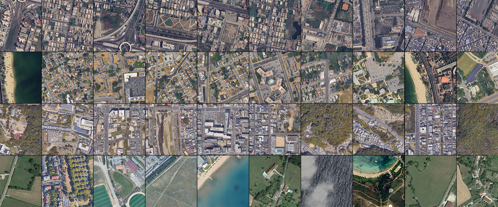

   
  
⠀
 
  <h1>Super Resolution Moon Hazard Map</h1>

## Idea

*Lunar Lander SafeTouch*: High-Resolution Hazard Mapping and Real-Time Navigation using Super-Resolution Techniques for Precision Moon Landings

## Description

The "*Lunar Lander SafeTouch*" project addresses the challenge of limited high-resolution data coverage on the moon's surface by pioneering an innovative approach to lunar landing safety. Leveraging **Terrain Mapping Camera (TMC)** images at `5m` resolution for `80% coverage` and sparse but high-resolution **Orbiter High-Resolution Camera (OHRC)** data at `25cm` resolution, this project employs state-of-the-art super-resolution techniques to create a hazard map with a `1m` grid spacing. The hazard map integrates essential hazard definitions, including slope thresholds, crater and boulder specifications, crater distribution analysis, and shadow considerations.

- The core of the project involves the development and training of deep learning models for super-resolution, allowing for the generation of high-resolution features crucial for assessing landing hazards. The hazard map is designed to facilitate safe lunar navigation, and a real-time navigation system is implemented for dynamic decision-making during the landing phase.

- Demonstrations and simulations showcase the adaptability of the lander's navigation system to real-time updates and changing lunar conditions. The project emphasizes user-friendly interfaces for mission control and operators to interact seamlessly with the hazard map and navigation system.

- This multidisciplinary initiative not only pushes the boundaries of lunar exploration by maximizing the utility of available data but also contributes valuable insights into real-time decision-making for precision moon landings. The "Lunar Lander SafeTouch" project serves as a pioneering effort in advancing the safety and accuracy of lunar landings, laying the foundation for future exploration missions.

-> [Project Outline](resources/docs/projectoutline.md)
-> [Google Collab](https://colab.research.google.com/drive/1yKkvgHD0VhtwdJkxp9aGPBkCQKJ5j3aL?usp=sharing)

  
⠀
 
   

